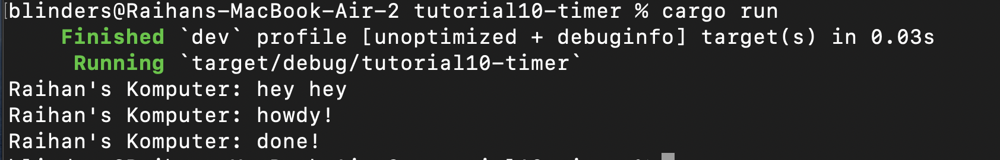
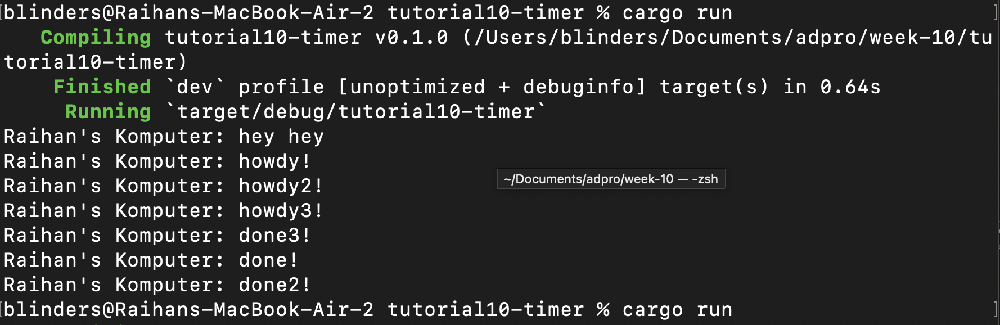
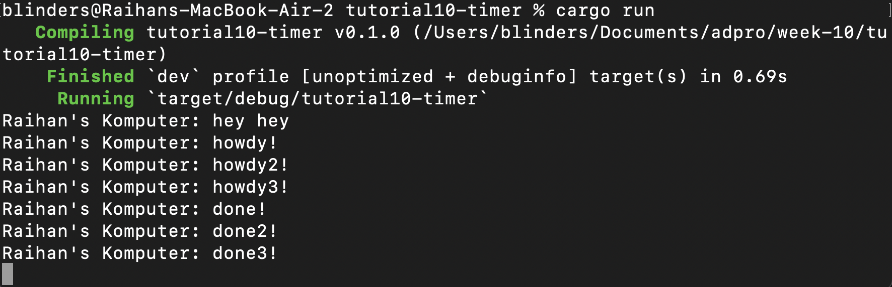

# Reflection

## 1.2. Understanding how it works.
`Take a look at what happened. Capture the result of your execution.`

As can be seen that the "hey hey" run first than the async program. This happen because an async program not run immediately but rather getting runned after being run or called. 

## 1.3. Multiple Spawn and removing drop

`Capture your screen as many as
needed (but not more than three) and provide explanation why it is like that`

### With Drop Statement

### Without Drop Statement

The behavior of the program can be explained by understanding the difference between synchronous and asynchronous execution. The line that prints "hey hey" runs synchronously in the main function before the executor begins executing any asynchronous tasks. As a result, it always prints first. The three asynchronous tasks, each printing a "howdy" message followed by a two-second delay and then a "done" message, are all spawned before the executor is run. When the executor starts, it polls each future. Initially, each future prints its "howdy" message and then yields control by awaiting the custom `TimerFuture`, which causes the task to return `Poll::Pending`.

The `TimerFuture` spawns a new thread for each task, which sleeps for two seconds before marking the task as complete and waking it. Once the task is woken, the executor resumes polling it and completes the future by printing the corresponding "done" message. Because each timer runs on its own thread, the order in which the "done" messages appear can vary depending on which thread completes and gets scheduled back on the executor first. 

And lastly if the `Spawner` is not explicitly dropped, the executor continues waiting for more tasks, because it assumes additional tasks might still be submitted. This causes the program to keep running even after all tasks have completed. When `drop(spawner)` is called, it indicates to the executor that no more tasks will be sent, allowing it to finish execution once the queue is empty.
